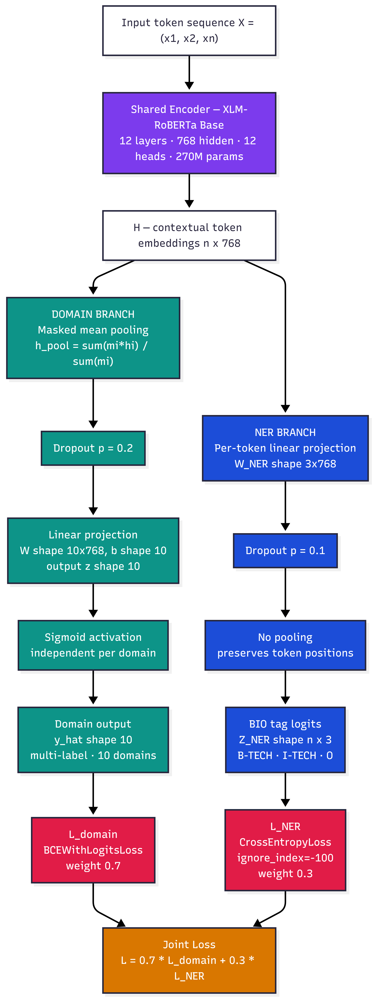
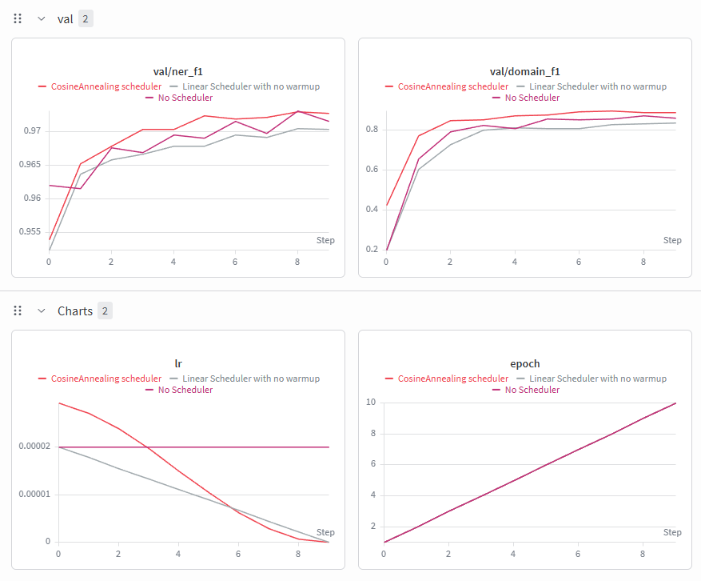
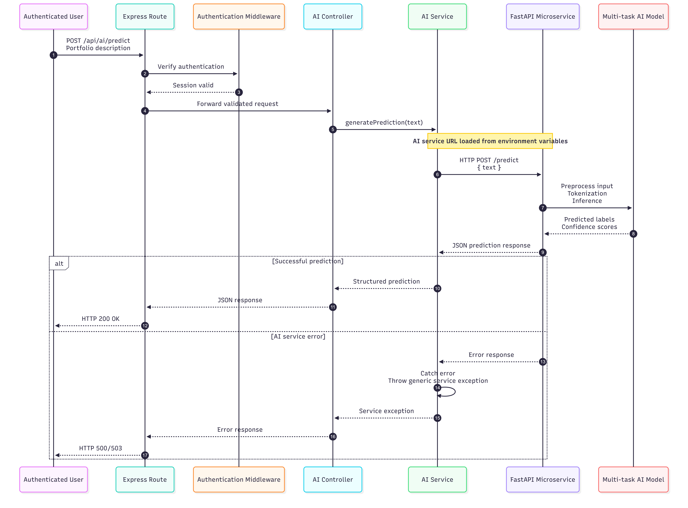
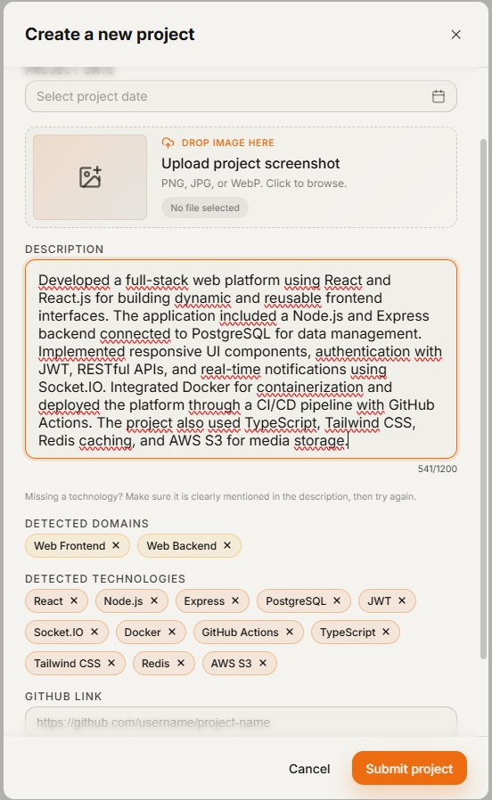
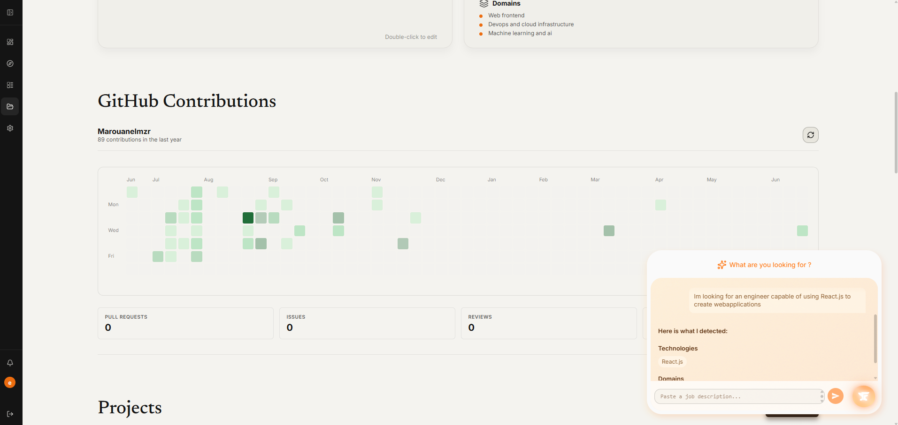

# AI-Powered Skills & Domain Extraction - FolioCraft

Automatic detection of technical competencies and domain expertise from student-generated portfolio content (project descriptions, internship summaries, extracurricular activities) and recruiter job offers, replacing manual skill entry with an NLP system trained end-to-end and shipped as a production microservice.

Built as an independent AI module inside the FolioCraft academic portfolio platform, developed over a 6-week research and engineering effort within the broader 10-week project.

> **This is the `ai/` module of the full FolioCraft monorepo.** It is not a standalone application: it's one service among several (Node.js backend, frontend, this AI service) that make up the platform, built and run as part of the project's shared Docker infrastructure rather than independently. See [Local Setup](#local-setup).

---

## Table of Contents

- [What This Does](#what-this-does)
- [Architecture](#architecture)
- [Results](#results)
- [Repository Structure](#repository-structure)
- [Data Pipeline](#data-pipeline)
- [Training](#training)
- [Technology Normalisation](#technology-normalisation)
- [Deployment](#deployment)
- [Backend & Frontend Integration](#backend--frontend-integration)
- [Local Setup](#local-setup)
- [Team & Collaboration Workflow](#team--collaboration-workflow)
- [Known Limitations & Future Work](#known-limitations--future-work)

---

## What This Does

Given a free-text description, the system jointly predicts:

1. **Technologies mentioned**: Named Entity Recognition (BIO tagging: `O`, `B-TECH`, `I-TECH`) over subword tokens, reconstructed into spans and normalised to canonical names (e.g. `ReactJS`, `React.js`, `react` all map to `React`).
2. **Technical domain(s)**: multi-label classification over 10 categories (Web Frontend, Web Backend, Mobile Development, DevOps and Cloud Infrastructure, Data Engineering, Machine Learning and AI, Cybersecurity, Embedded Systems and IoT, High Performance and Quantum Computing, Other).

Both tasks share a single `xlm-roberta-base` encoder with two lightweight task-specific heads, trained under a weighted joint loss. Supports mixed French/English input natively.

## Architecture



- **Domain head**: masked mean pooling (not `[CLS]`), since domain signal is distributed across the whole description rather than concentrated in one token. Empirically +0.03 F1 over CLS pooling.
- **NER head**: per-token linear projection, no pooling, so positional precision for entity boundaries is preserved.
- **Loss**: `α · BCEWithLogitsLoss(domain) + (1-α) · CrossEntropyLoss(NER, ignore_index=-100)`, with `α = 0.7`. The domain task converges much slower than NER and needs a larger share of the gradient.

Two architectural variants were tried and **discarded** after controlled experiments:
- A CRF layer on top of the NER head (negligible gain: spans are short, and BIO tagging violations were already rare).
- An NER-guided gating mechanism feeding technology confidence into the domain head (caused task interference and representation contamination, a documented negative result).

## Results

Evaluated once on a held-out test set (10%, never touched during development):

| Task                        | Micro F1 | Macro F1 |
|------------------------------|:--------:|:--------:|
| Domain Classification         | 0.891    | 0.898    |
| Technology Detection (NER)    | 0.974    | 0.946    |



Key training decisions and their measured impact:
- **Cosine annealing** scheduler over linear decay / no scheduler: +5.3 pts domain F1 (0.836 to 0.889).
- **bfloat16 mixed precision**: 1.5x training speedup with no accuracy loss.
- **Joint loss reweighting (α = 0.7)**: prevented the fast-converging NER task from starving the domain head of gradient signal through the shared encoder.

## Repository Structure

```
ai/
├── docs/
│   └── images/                # diagrams and screenshots referenced in this README
├── data/
│   ├── cleaned/              # validated, split (train/val/test) datasets ready for training
│   ├── raw/                  # raw collected CSV / unvalidated JSONL chunks
│   └── tech_registry.json    # persistent canonical-technology registry (semantic normalisation)
├── models/                   # tokenizer, PyTorch checkpoint, ONNX exports, normaliser resources
├── notebooks/
│   ├── 01_data_generation.ipynb
│   ├── 02_data_preparation.ipynb
│   ├── 03_Training.ipynb
│   └── 04_test_production.ipynb
├── scripts/
│   ├── csv_to_jsonl.py       # raw CSV to annotation-ready JSONL (Label Studio import)
│   ├── convert_annotations.py
│   ├── validate_jsonl.py     # chunk-based validation (spans, domains, duplicates, JSON integrity)
│   ├── split_dataset.py / split_stratified.py
│   ├── preprocess.py         # tokenisation, NER label alignment, domain multi-hot encoding
│   ├── dataset.py            # PyTorch Dataset + dynamic-padding collate_fn
│   ├── model.py              # MultitaskXLM module definition
│   ├── train.py              # train_step / eval_step / train orchestrator
│   ├── eval.py
│   ├── export_model.py       # PyTorch to ONNX export + numerical verification
│   ├── inference.py          # ONNX Runtime inference pipeline
│   ├── normalise.py          # TechNormaliser (semantic technology normalisation)
│   ├── main.py                # FastAPI application entry point
│   └── download_models.sh    # fetches model artifacts from remote storage at build time
├── Dockerfile
├── requirements.txt          # minimal deployment dependency set
└── .env                      # runtime configuration (not committed)
```

Research-only dependencies (`torch`, `transformers` for training, `datasets`, `accelerate`, `wandb`, `seqeval`, `scikit-learn`, `sentence-transformers`) are kept local to the training environment and are never shipped to the deployment container. The production image ships a deliberately minimal set: `fastapi`, `uvicorn`, `pydantic`, `onnxruntime`, `transformers` (tokenizer only), `numpy`, `gdown`.

## Data Pipeline

No public dataset satisfied the project's constraints (bilingual, multi-label domains, technology-level entities, explicit negative/`Other` examples), so a full data pipeline was built from scratch:

1. **Manual seed set** (~60 samples): collected from LinkedIn projects, GitHub READMEs, internship summaries, and public job offers (PII stripped), annotated in [Label Studio](https://labelstud.io/) using BIO tagging for technologies and multi-label domain tags.
2. **Synthetic augmentation** (~2,290 samples): generated with Claude via structured prompts enforcing schema validity (`text`, `entities` with exact character offsets, `domain_labels`), distributed across team members' accounts to work around free-tier rate limits, and merged into a single working set.
3. **Iterative class-balancing loop**: after each generation round, class distribution was analysed and subsequent prompts were targeted at underrepresented domains, reducing the max/min domain ratio from 3.3:1 to roughly 2.7:1 across the final 2,350-record dataset.
4. **Chunk-based validation**: every generated chunk was validated independently (text integrity, domain taxonomy membership, entity span correctness `text[start:end] == value`, overlap/duplicate detection, JSON integrity) before being merged; chunks with too many errors were regenerated from scratch rather than hand-patched.
5. **Stratified 80/10/10 split** by primary domain label, preserving class balance across train/val/test.

Final dataset: 2,350 samples, roughly 51% French / 49% English, 0 samples truncated above the 256-token limit.

## Training

- Two-phase protocol: 5-epoch exploratory runs to discriminate between architectural variants, followed by a single 10-epoch production run on the finalised architecture.
- AdamW (lr = 2e-5), gradient clipping at 1.0, `bfloat16` autocast + `GradScaler` with the correct unscale-then-clip ordering.
- All runs tracked in Weights & Biases (`portfolio-nlp` project): training/validation loss, both F1 metrics, and learning rate logged every epoch; best checkpoint selected by lowest validation loss, not last epoch.

## Technology Normalisation

Raw NER spans are surface-form variants of the same underlying technology (`React`, `ReactJS`, `React.js`, `react`). Rather than hand-maintained synonym dictionaries or fuzzy string matching, both of which fail to scale, normalisation is done with **sentence embeddings**:

- `all-MiniLM-L6-v2` encodes each extracted string into a 384-dim vector.
- Cosine similarity is computed against a persistent registry of canonical entries. Above threshold (`0.6`, tuned empirically), the input is mapped to the existing canonical name; below threshold, it's registered as a new canonical entry.
- The registry persists to `data/tech_registry.json` and grows over time as the platform processes more descriptions, with no retraining required to absorb new naming conventions.

## Deployment

1. **ONNX export**: the trained `MultitaskXLM` (which returns a dict) is wrapped in a thin adapter returning a plain tensor tuple, since the exporter can't trace dictionary outputs. Exported with dynamic batch/sequence-length axes (opset 17) so the served model isn't locked to the tracing input's shape. Verified two ways after export: structural (`onnx.checker`) and numerical (max abs diff below 1e-5 between PyTorch and ONNX Runtime logits on the same input).
2. **Inference engine**: a single-threaded `onnxruntime.InferenceSession` (appropriate for CPU-only serving, where request-level concurrency is handled by the web server rather than inside a single forward pass), the HuggingFace tokenizer loaded from a local serialized directory (no network dependency at inference time), and the `TechNormaliser`, all loaded once at process startup.
3. **FastAPI microservice**: `GET /`, `GET /health` (for orchestration/load-balancer probes), and `POST /predict` (text in, technologies + raw spans + domains out), with model loading handled via FastAPI's lifespan context manager so a 270M-parameter model is loaded exactly once, not per request.
4. **Containerisation**: separate development and production Docker images sharing the same base dependency set.
   - Model artifacts not baked into the image are fetched at build time via `download_models.sh`.
   - The production image is built from explicit `COPY`s of only what's needed at runtime (API entrypoint, inference module, normalisation utilities) to minimise attack surface and image size.
   - Runs as a non-root `appuser` in production; the dev image keeps root access for debugging.
   - A `patchelf` post-install step clears the executable-stack flag on the ONNX Runtime shared library to suppress a kernel-level security warning.

An alternative, smaller encoder (`microsoft/mdeberta-v3-base`) was evaluated to cut the ~1.2 GB model footprint, but consistently underperformed XLM-RoBERTa on this multilingual, multi-task setup. The deployment cost was instead absorbed through ONNX export rather than swapping the backbone.

## Backend & Frontend Integration

- The Node.js FolioCraft backend talks to the Python microservice through a dedicated service layer that hides all HTTP details behind a single function; the rest of the backend has no knowledge of how predictions are produced.
- The route calling the AI service sits behind authentication middleware; the service URL is injected via environment variable so the same backend build can target different environments without code changes.
- Errors from the microservice are caught at the service boundary and re-thrown as generic exceptions, so internal AI service details never leak into client-facing API responses.



**Student-facing**: live technology/domain predictions surfaced directly in the project description form as the student types, doubling as a writing-quality nudge.



**Recruiter-facing**: a conversational search component. Recruiters describe requirements in natural language, which is run through the same prediction pipeline and used to filter/rank candidate portfolios.



## Local Setup

This module is one service in the FolioCraft monorepo and is not meant to be built or run in isolation. The whole stack (backend, frontend, and this AI service) is defined and orchestrated through the project's shared Compose file:

```bash
# from the root of the FolioCraft monorepo
docker compose -f infrastructure/docker/docker-compose.yml up --build
```

This builds the `ai/` service's image (fetching model artifacts via `download_models.sh` as part of the build), wires it up on the internal network alongside the backend and frontend containers, and exposes the endpoints the backend is configured to call. Environment configuration (model URLs, ports, etc.) is provided through the `.env` files consumed by Compose, not set manually per service.

If you only need to iterate on the AI service itself, you can still target it specifically:

```bash
docker compose -f infrastructure/docker/docker-compose.yml up --build ai
```

Training and dataset-generation notebooks (`notebooks/01` to `04`) are not part of the served container. They require the separate research dependency set (`torch`, `transformers`, `datasets`, `accelerate`, `wandb`, `seqeval`, `scikit-learn`, `sentence-transformers`) installed in a local Python environment, kept out of `requirements.txt` intentionally to keep the deployment image lean.

## Team & Collaboration Workflow

This AI module was developed and owned end-to-end by a single engineer within the 11-person FolioCraft team, alongside Team Lead / Scrum Master responsibilities for the broader project. A few workflow choices were shaped by that context:

- **Synthetic data generation was distributed across teammates' accounts** to work around per-account rate limits on the free-tier generation model, with target class distributions communicated after each balancing iteration so everyone generated toward the same underrepresented domains rather than duplicating effort.
- **Research and deployment dependencies were deliberately split**: since ML development wasn't shared across the team, the full research stack was kept local rather than imposed on every contributor's environment or baked into the shared Docker infrastructure. Only the minimal inference dependency set is part of the team's shared `requirements.txt` and Compose pipeline.
- **The AI service is fully decoupled from the main backend** via a well-defined HTTP contract (`/predict`, `/health`). This let the Node.js backend team and the AI component be developed, tested, and deployed independently without blocking on each other, while still being orchestrated together through the shared Compose setup.
- **Experiment tracking (W&B) and the export verification step** double as a handover mechanism: any teammate can trace which run produced the shipped checkpoint, and the numerical-equivalence check on ONNX export gives confidence that "the model in staging" and "the model that was evaluated" are the same model.

## Known Limitations & Future Work

- The dataset is roughly 97% synthetic; authentic student-written descriptions remain underrepresented relative to LLM-generated ones.
- The `Other` domain and technology-sparse, business-language descriptions are the weakest spot for the domain classifier. The discarded NER-gating experiment was an attempt at addressing this that made things worse, not better.
- The `TechNormaliser` registry has not yet been audited at production scale; canonicalisation quality on rare/ambiguous technology names should be reviewed as real traffic accumulates.
- Planned: collecting more authentic student descriptions, auditing the registry post-deployment, and exploring cross-profile signals to help classify technologically sparse descriptions.